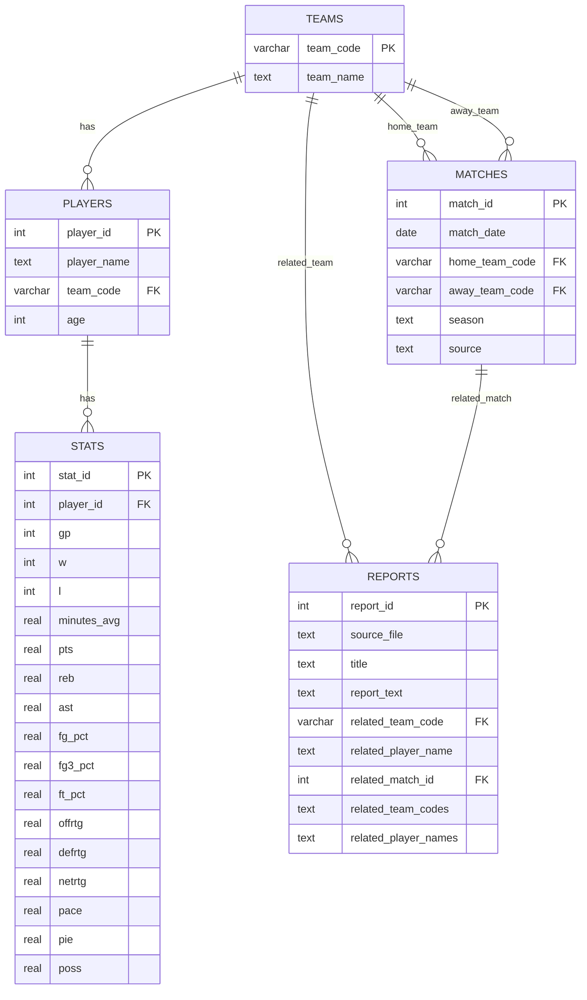

# Base de données — SportSee

Ce dossier contient toute la partie base de données du projet SportSee.

L’objectif est de stocker :
- les données structurées issues du fichier Excel ;
- les données textuelles issues des rapports PDF / Reddit ;
- la structure relationnelle nécessaire au futur SQL Tool.

---

## Contenu du dossier

- `schema.sql` : création du schéma PostgreSQL
- `schemas.py` : validation des données avec Pydantic
- `load_excel_to_db.py` : ingestion des données Excel dans PostgreSQL
- `load_reports.py` : ingestion des rapports PDF dans PostgreSQL
- `README.md` : documentation technique de la base

---

## Prérequis

- PostgreSQL installé
- base `sportsee` créée
- utilisateur dédié avec droits suffisants
- variables d’environnement configurées dans `.env`

Exemple :

```env
DB_HOST=localhost
DB_PORT=5432
DB_NAME=sportsee
DB_USER=sportsee_user
DB_PASSWORD=secure_password
```
## Initialisation de la base

Avant toute chose, exécuter le script :

```bash
psql -U postgres -f database/init_db.sql
```

Ce script :
- crée la base sportsee
- crée l'utilisateur dédié
- configure les droits

## Schéma relationnel



## Création du schéma
Le schéma PostgreSQL est défini dans schema.sql.

Il peut être exécuté depuis pgAdmin ou via script Python.


## Chargement des données Excel
Le script load_excel_to_db.py permet de :
- lire le fichier Excel NBA ;
- nettoyer les colonnes ;
- valider les données avec Pydantic ;
- insérer les données dans teams, players et stats.

Commande :
```bash
python -m database.load_excel_to_db
```

## Chargement des rapports PDF
Le script load_reports.py permet de :
- parcourir les fichiers PDF dans inputs/ ;
- extraire leur texte via le data_loader ;
- insérer les contenus dans la table reports.

Commande :

```bash
python -m database.load_reports
```

## Tables actuellement alimentées
**teams** Contient les équipes NBA.
**players** Contient les joueurs et leur équipe.
**stats** Contient les statistiques agrégées par joueur.
**reports** Contient les rapports textuels extraits depuis les PDF Reddit.

## Tables prévues pour évolution
**matches**
Cette table est prévue pour intégrer plus tard des données match par match.
Elle est présente dans le schéma mais n’est pas encore alimentée dans la version actuelle.

## Utilisateur lecture seule pour le tool SQL

Pour sécuriser l’exécution des requêtes générées par le LLM, un utilisateur PostgreSQL dédié en lecture seule peut être créé.

Ce compte permet :
- d’interroger les tables nécessaires au tool SQL ;
- d’empêcher toute modification accidentelle de la base.

Script SQL associé :
- [create_readonly_user.sql](create_readonly_user.sql)

Exécution :
```bash
psql -U postgres -d sportsee -f database/create_readonly_user.sql
```


## Limites actuelles
Le dataset Excel utilisé contient des statistiques agrégées par joueur.
Il ne permet pas encore :
l’analyse match par match ;
- la comparaison domicile / extérieur ;
- l’analyse sur une période glissante ;
- la reconstruction d’une chronologie fine.
La table matches a été prévue pour permettre cette évolution future.

## Rôle dans l’architecture globale
- PostgreSQL stocke les données structurées et textuelles ;
- le SQL Tool exploitera les tables structurées pour répondre aux questions chiffrées ;
- le pipeline RAG exploitera les rapports pour apporter du contexte.

Cette architecture prépare un système hybride :
- SQL pour les réponses fiables et traçables ;
- RAG pour l’enrichissement contextuel.